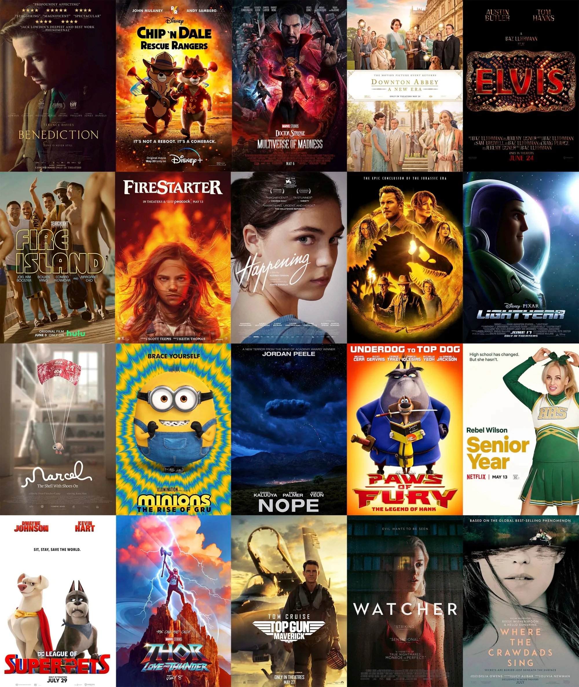

<style>
@import url('https://fonts.googleapis.com/css2?family=Cabin:wght@400;500;600;700&display=swap');

body, 
h1, h2, h3, h4, h5, h6, 
.navbar, 
.section.level1, 
.section.level2 {
  font-family: 'Cabin', sans-serif;
}

.navbar.navbar-inverse {
  background-color: #133E43 !important;
  border-color: #133E43 !important;
}

/* Navbar text */
.navbar.navbar-inverse .navbar-brand,
.navbar.navbar-inverse .navbar-nav > li > a {
  color: #EDE6E3 !important;
  font-weight: 600;
}

/* Hover state for navbar tabs */
.navbar-inverse .navbar-nav > li > a:hover {
  background-color: #133E43 !important;
  color: #D3E4E7 !important;
}

/* Active tab (open tab) */
.navbar-inverse .navbar-nav > .active > a,
.navbar-inverse .navbar-nav > .active > a:focus,
.navbar-inverse .navbar-nav > .active > a:hover {
  background-color: #133E43 !important;
  color: #D3E4E7 !important;
}

/* Change main number (value) color */
.value-box .value {
  color: #246A73 !important;
}

/* Change caption (label) color */
.value-box .caption {
  color: #246A73 !important;
}

/* Rounded corners for value boxes */
.value-box {
  border-radius: 6px !important;     
}

/* Header styling */
table.dataTable thead th {
  background-color: #246A73 !important;
  color: white !important;
}

/* Row hover color */
table.dataTable tbody tr:hover {
  background-color: #EDE6E3 !important;
}

/* Smaller DT table font */
table.dataTable td,
table.dataTable th {
  font-size: 12px !important; 
}

/* Hover state */
.nav-tabs > li > a:hover {
color: #246A73 !important;
border: 1px solid #F06449;
}

/* Active tab */
.nav-tabs > li.active > a,
.nav-tabs > li.active > a:focus,
.nav-tabs > li.active > a:hover {
background-color: #246A73 !important;
color: white !important;
border: 1px solid #246A73;
}

</style>


```{r setup, include=FALSE}
library(flexdashboard)
library(tidyverse)
library(plotly)
library(DT)
library(viridis)
library(treemapify)
library(ggwordcloud)
library(networkD3)
library(scales)
library(lubridate)
library(ggridges)
library(flexdashboard)
library(patchwork)
```


```{r load data, include = FALSE}
# Read in data
movies_clean <- read_rds("data/movies_clean.rds")
```

```{r}
#colors 
teal_246A73_to_purple_gradient <- list(
  list(0.00, "#A8D1D6"),
  list(0.071, "#84B7C0"),
  list(0.143, "#609DAA"),
  list(0.214, "#3C8394"),
  list(0.286, "#246A73"),
  list(0.357, "#285F76"),
  list(0.429, "#2C5579"),
  list(0.500, "#304B7C"),
  list(0.571, "#34417F"),
  list(0.643, "#383782"),
  list(0.714, "#3C2D85"),
  list(0.786, "#402388"),
  list(0.857, "#44198B"),
  list(0.929, "#480F8E"),
  list(1.00, "#4C0591")
)

abb_colors <- list(
  list(0.000, "#A8D1D6"),
  list(0.143, "#72AAB5"),
  list(0.286, "#3C8394"),
  list(0.429, "#246A73"),
  list(0.571, "#2C5579"),
  list(0.714, "#34407F"),
  list(0.857, "#3C2B85"),
  list(1.000, "#44168B")
)

gradient_colors <- sapply(abb_colors, function(x) x[[2]])

```

# Home 

<div style="display: flex;">

<div style="flex: 3; padding-right: 3px;">

<span style="color: #246A73;font-size: 30px;">Welcome to Movie Prophet!</span>

<span style="color: #246A73;">**About this dashboard**</span>

This dashboard explores and analyzes factors that influence popularity of American movies released between 2000-2025. Factors such as genre, time of year of release, and MPA film rating of the movie are included. The goal of the dashboard is to allow studios and investors to explore the trends in preferences of the audiences consuming American movies, and what factors to consider when making a new movie/investing in a new movie, for high box office sales. 

The first sections of the dashboard include detailed visualizations showcasing the relationship between key factors and movie performance, measured by box office revenue. This includes interactive graphs showing how preferences for genres have changed over time, performance of movies by release time, and the most well-performing genres. 

The second part of the dashboard includes machine learning models to determine if movie box office revenue can be predicted by the factors explored in the dashboard (e.g., genre, runtime, time of year of release). The performance of each of the models is featured, and the model that performs the best will be identified.

</div>

<div style="flex: 1.3; margin-left: -30px; text-align: right;">
<div style="text-align:right">

</div>
</div>

</div>

<span style="color: #246A73;">**How to use this dashboard**</span>

<span style = "color:#246A73;">Overview</span>

This tab includes general information such as average rating across all movies, and total box office revenue from all movies included in the dashboard. Additionally, this tab features an interactive data table that allows the user to search by a variety of variables such as movie title, IMDB rating, or length of movie. 

<span style = "color:#246A73;">Market Analysis</span>

This tab features data visualizations on box office revenue by different variables such as month of movie release, distribution of box office revenues for American films from 2000-2025, and top movies by box office revenue. 

<span style = "color:#246A73;">Genre Analysis</span>

This tab features different analyses focusing on which genres tend to have higher box office revenues, and additionally, which combination of genres tend to have higher box office revenues. 

<span style = "color:#246A73;">Time Trends</span>

This tab features changes in various movie parameters over time. This includes average IMDB ratings, MPA film rating, and number of movies released each year.  

<span style = "color:#246A73;">Movie Success Prediction</span>

This tab...

<span style="color: #246A73;">**Data Sources**</span>

1. Wikipedia List of American Films released between 2000-2025 (up until November 16 2025)
2. OMDB API for box office revenue, IMDB ratings, genre, runtime, and other variables.


# Overview 

Row {data-height=100}
-----------------------------------------------------------------------

```{r include= FALSE}
#| warning: false
create_overview_cards <- function(data) {
  total_movies <- nrow(data)
  total_revenue <- sum(data$BoxOffice_adjusted, na.rm = TRUE)
  avg_rating <- mean(data$imdbRating, na.rm = TRUE)
  date_range <- paste(
    min(data$Released_year, na.rm = TRUE),
    "-",
    max(data$Released_year, na.rm = TRUE)
  )

  # Return as list for display
  list(
    total_movies = total_movies,
    total_revenue = dollar(total_revenue),
    avg_rating = round(avg_rating, 2),
    date_range = date_range
  )
}

cards <- create_overview_cards(movies_clean)
```

### Total Number of Movies {.value-box}

```{r}
renderValueBox({
  valueBox(color = "#EDE6E3",value = cards$total_movies)})
```


### Total Revenue in 2025 Dollars {.value-box}
```{r}
renderValueBox({
  valueBox(color = "#EDE6E3",value = cards$total_revenue)})
```


### Average IMDB Rating {.value-box}
```{r}
renderValueBox({
  valueBox(color = "#EDE6E3",value = cards$avg_rating)})
```


### Date Range of Released Movies {.value-box}
```{r}
renderValueBox({
  valueBox(color = "#EDE6E3",value = cards$date_range)})
```

Row {data-height=400}
-----------------------------------------------------------------------

### Movie Interactive Database (2000-2025)

```{r}
create_data_table <- function(data) {
  # Prepare table data with both nominal and adjusted values
  table_data <- data %>%
    select(
      Title,
      Released_year,
      Genre,
      Rated,
      Director,
      BoxOffice_num,
      BoxOffice_adjusted,
      Metascore,
      imdbRating,
      imdbVotes,
      Runtime_num
    ) %>%
    mutate(
      # Format nominal box office
      BoxOffice_Nominal = case_when(
        is.na(BoxOffice_num) ~ "N/A",
        BoxOffice_num == 0 ~ "N/A",
        BoxOffice_num < 1000000 ~ paste0(
          "$",
          format(round(BoxOffice_num / 1000), big.mark = ","),
          "K"
        ),
        BoxOffice_num < 1000000000 ~ paste0(
          "$",
          format(round(BoxOffice_num / 1000000, 1), big.mark = ","),
          "M"
        ),
        TRUE ~ paste0(
          "$",
          format(round(BoxOffice_num / 1000000000, 2), big.mark = ","),
          "B"
        )
      ),
      # Format adjusted box office
      BoxOffice_Adj = case_when(
        is.na(BoxOffice_adjusted) ~ "N/A",
        BoxOffice_adjusted == 0 ~ "N/A",
        BoxOffice_adjusted < 1000000 ~ paste0(
          "$",
          format(round(BoxOffice_adjusted / 1000), big.mark = ","),
          "K"
        ),
        BoxOffice_adjusted < 1000000000 ~ paste0(
          "$",
          format(round(BoxOffice_adjusted / 1000000, 1), big.mark = ","),
          "M"
        ),
        TRUE ~ paste0(
          "$",
          format(round(BoxOffice_adjusted / 1000000000, 2), big.mark = ","),
          "B"
        )
      ),
      # Format rating
      IMDb_Rating = round(imdbRating, 1),
      # Format other columns
      Votes = format(imdbVotes, big.mark = ","),
      Runtime = paste(Runtime_num, "min")
    ) %>%
    select(
      Title,
      Released_year,
      Genre,
      Rated,
      Director,
      BoxOffice_Nominal,
      BoxOffice_Adj,
      Metascore,
      IMDb_Rating,
      Votes,
      Runtime
    )

  # Create data table
  datatable(
    table_data, 
    filter = 'top',
    rownames = FALSE,
    options = list(
      pageLength = 25,
      searchHighlight = TRUE,
      paging = TRUE,
      dom = 'Brtip',
      buttons = c('copy', 'csv', 'excel'),
      columnDefs = list(
        list(className = 'dt-center', targets = c(1, 6, 7, 8, 9)),
        list(className = 'dt-right', targets = c(4, 5))
      )
    ),
    colnames = c(
      'Title',
      'Year',
      'Genres',
      'Rated',
      'Director(s)',
      'Box Office (Nominal)',
      'Box Office (2024 adj.)',
      'Metascore',
      'IMDb Rating',
      'Votes',
      'Runtime'
    )
  )
}
```

```{r}
movies_table <- create_data_table(movies_clean)
movies_table
```

# Market Analysis

Row {.tabset data-width=500}
---------------------------------------------------

### Seasonal Movie Performance

```{r}
create_seasonal_analysis <- function(data) {
  seasonal_data <- data %>%  # Use the function parameter
    filter(!is.na(Released)) %>%
    mutate(
      release_month = lubridate::month(Released, label = TRUE),
      month_num = lubridate::month(Released)
    ) %>%
    group_by(release_month, month_num) %>%
    summarise(
      avg_revenue = mean(BoxOffice_adjusted, na.rm = TRUE) / 1e6,
      movie_count = n(),
      avg_rating = mean(imdbRating, na.rm = TRUE),
      .groups = "drop"
    ) %>%
    arrange(month_num) %>%
    mutate(
      month_full = month.name[month_num],
      theta = (month_num - 1) * 30
    )

  p <- plot_ly(
    data = seasonal_data,
    type = "barpolar",
    r = ~avg_revenue,
    theta = ~theta,  # Fixed: was ~month
    marker = list(
      color = ~avg_rating,
      colorscale = abb_colors,
      showscale = TRUE,
      line = list(color = "white", width = 1),
      colorbar = list(title = "Average IMDB Rating", 
                      titleside = "right",
                      thickness = 15,
                      len = 0.7,
                      x = 1.02,
                      xanchor = "left")
    ),
    text = ~paste0(
      "<b>", month_full, "</b><br>",
      "Average Revenue: $", round(avg_revenue, 1), "M<br>",
      "Number of movies: ", movie_count, "<br>",
      "Average IMDB Rating: ", round(avg_rating, 1)
    ),
    hoverinfo = "text"
  ) %>%
    layout(
      title = list(
        text = "Box Office Revenue ($) by Month of Release",
        x = 0.5,
        font = list(size = 16, family = "Cabin",
        size = 18,
        color = "#231F20"
      ) ),
    font = list(
      family = "Cabin",
      color = "#231F20"
      ),
      polar = list(
        radialaxis = list(
          showline = FALSE,
          visible = FALSE,
          tickfont = list(size = 10),
          showgrid = TRUE
        ),
        angularaxis = list(
          direction = "clockwise",
          period = 12,
          tickvals = seasonal_data$theta,
          ticktext = seasonal_data$release_month
        )
      ),
      showlegend = FALSE,
      margin = list(l = 50, r = 100, t = 80, b = 50),
      coloraxis = list(
        colorbar = list(title = "Avg Rating")
      )
    )
  
  return(p)  
}

# Server
output$seasonal <- renderPlotly({
  create_seasonal_analysis(movies_clean)
})

# Output
plotlyOutput("seasonal")
```

### Top 20 Movies by Box Office Revenue

```{r}
# Data
top_20 <- movies_clean %>%
  group_by(Year) %>%
  arrange(desc(BoxOffice_adjusted)) %>%
  slice_head(n = 20) %>%
  ungroup()

years <- sort(unique(movies_clean$Year))
years <- years[-length(years)]
  
# UI
selectInput('Year', '', choices = years , selected = "2024")

# Server

output$top20 <- renderPlotly({
  data_filtered <- top_20 %>%
    filter(Year == input$Year)
  
  p <- ggplot(
    data_filtered,
    aes(x = BoxOffice_adjusted, y = reorder(Title, BoxOffice_adjusted), text = paste(
        "Box Office Revenue:", "$",BoxOffice_adjusted,
        "<br>Title:", Title,
        "<br>Metacritic Score:", Metascore,
        "<br>IMDB Rating:", imdbRating))
  ) +
    geom_segment(aes(xend = 0, yend = Title), color = "#071F20") +  
    geom_point(aes(color = imdbRating), size = 3) +
    scale_x_continuous(labels = scales::dollar_format(scale = 1e-6, suffix = "M")) +
    scale_color_gradientn(colors = gradient_colors)+
    theme_minimal() +
    labs(
      title = paste("Top 20 Movies by Box Office Revenue -", input$Year),
      x = "Box Office Revenue (Millions)",
      y = "",
      color = "IMDB Rating"
    )+
    theme(text = element_text(family = "Cabin"))
  
  ggplotly(p, height = 500, tooltip = "text") 
})

# Output 
plotlyOutput('top20')
```


### Box Office Revenue Distribution

```{r}
create_box_office_distribution <- function(data) {
  p1 <- data %>%
    filter(BoxOffice_adjusted > 0) %>%
    ggplot(aes(x = BoxOffice_adjusted / 1e6, fill = log10(after_stat(x)))) +
    geom_histogram(bins = 50, alpha = 0.8, 
                   aes(text = paste0(
                     "Revenue Range: $", round(after_stat(xmin), 1), "M - $", round(after_stat(xmax), 1), "M",
                     "<br>Number of Movies: ", after_stat(count)
                   ))) +
    scale_fill_gradientn(colours = gradient_colors) +
    scale_x_log10(
      breaks = c(0.1, 1, 10, 100, 1000, 10000),
      labels = c("0.1", "1", "10", "100", "1K", "10K")
    ) +
    labs(
      title = "Box Office Distribution - Inflation Adjusted (2024 dollars)",
      x = "Box Office Revenue (Million USD)",
      y = "Number of Movies"
    ) +
    theme_minimal() +
    theme(legend.position = "none",
          text = element_text(family = "Cabin"))

  plotly::ggplotly(p1, tooltip = "text")
}

# Output
log_dist <- create_box_office_distribution(movies_clean)
log_dist
```


### MPA Film Ratings
```{r}
# Data
rated_movies <- movies_clean %>%
  filter(!is.na(Rated)) %>% 
  mutate(
    # Combine "Unrated" and "Not Rated" into a single category
    Rated = case_when(
      Rated %in% c("Unrated", "Not Rated") ~ "Unrated/Not Rated",
      TRUE ~ Rated
    )
  ) %>%
  group_by(Rated) %>%
  summarize(
    number_movies = n(), 
    average_revenue = mean(BoxOffice_adjusted, na.rm = TRUE),
    .groups = 'drop'
  ) %>%
  arrange(desc(average_revenue))

# Server logic for first plot
output$rating <- renderPlotly({
  p1 <- ggplot(
    rated_movies,
    aes(x = average_revenue, y = reorder(Rated, average_revenue), 
        text = paste("MPA Film Rating:", Rated,
                    "<br>Average Revenue: $", round(average_revenue/1e6, 1), "M"))
  ) +
    geom_col(fill = "#246A73") +
    theme_minimal() +
    labs(x = "Average Box Office Revenue ($)", y = "MPA Film Rating") +
    scale_x_reverse(labels = scales::dollar_format(scale = 1e-6, suffix = "M"))  
                    # reverse x-axis for mirror effect
  
# Create second plot (count)
  p2 <- ggplot(
    rated_movies, 
    aes(x = number_movies, y = reorder(Rated, average_revenue), 
        text = paste("MPA Film Rating:", Rated,
                    "<br>Number of Movies:", number_movies))
  ) +
    geom_col(fill = "#3C2B85") +
    theme_minimal() +
    labs(x = "Number of Movies", y = "") +
    theme(axis.text.y = element_blank())  # Remove y-axis labels from second plot
  
  # Convert to plotly and combine
  plot1 <- ggplotly(p1, tooltip = "text")
  plot2 <- ggplotly(p2, tooltip = "text")
  
  # Use subplot to combine
  subplot(plot1, plot2, nrows = 1, shareY = TRUE, titleX = TRUE) %>%
    layout(height = 500)
})

# Output
plotlyOutput('rating')
  
```


# Genre Analysis

Column {.tabset data-width=350}
-----------------------------------------------------------------------
### Primary Genre Heatmap {data-height=900}

```{r}
#Function
create_genre_treemap <- function(data) {
  genre_stats <- data %>%
    group_by(Genre1) %>%
    summarise(
      total_revenue = sum(BoxOffice_adjusted, na.rm = TRUE),
      movie_count = n(),
      avg_rating = mean(imdbRating, na.rm = TRUE),
      .groups = "drop"
    ) %>%
    filter(movie_count >= 10) %>% 
    mutate(
      label = paste0(
        "Primary Genre: ", Genre1,
        "<br>Revenue: $", round(total_revenue / 1e9, 1), "B",
        "<br>Movies: ", movie_count,
        "<br>IMDB Rating: ", round(avg_rating, 1)
      ),
      text_color = ifelse(avg_rating > 6.0, "#EDE6E3", "#231F20")
    )

  plot_ly(
    data = genre_stats,
    type = "treemap",
    labels = ~Genre1,
    parents = NA,
    values = ~total_revenue,
    customdata = ~label,
    hovertemplate = "%{customdata}<extra></extra>",
    textposition = "middle center",
    marker = list(
      colors = ~avg_rating,
      colorscale = abb_colors,
    line = list(color = "#FFFFFF", width = 1.5),
    showscale = TRUE
  ),
  textfont = list(
    color = ~text_color,
    size = 14
  )
) %>%
  layout(
    title = list(
      text = "Primary Movie Genres by Total Box Office Revenue",
      x = 0.5,  # Center the title
      font = list(
        family = "Cabin",
        size = 18,
        color = "#231F20"
      )
    ),
    font = list(
      family = "Cabin",
      color = "#231F20"
    ),
    paper_bgcolor = "#FFFFFF",
    plot_bgcolor  = "#FFFFFF",
    margin = list(l = 10, r = 10, t = 40, b = 10)
  )
}

# Server
output$treemap <- renderPlotly({
  create_genre_treemap(movies_clean)
})

#Output 
plotlyOutput("treemap", height = "100%")
```

### Secondary Genre Heatmap 

```{r}
# Function
create_second_genre_treemap <- function(data) {
  genre_stats <- data %>%
    filter(!is.na(Genre2), Genre2 != "") %>%
    group_by(Genre2) %>%
    summarise(
      total_revenue = sum(BoxOffice_adjusted, na.rm = TRUE),
      movie_count = n(),
      avg_rating = mean(imdbRating, na.rm = TRUE),
      .groups = "drop"
    ) %>%
    filter(movie_count >= 10) %>%
    mutate(
      label = paste0(
        "Secondary Genre: ", Genre2,
        "<br>Revenue: $", round(total_revenue / 1e9, 1), "B",
        "<br>Movies: ", movie_count,
        "<br>IMDB Rating: ", round(avg_rating, 1)
      ),
      text_color = ifelse(avg_rating > 6.0, "#EDE6E3", "#231F20")
    )

  plot_ly(
    data = genre_stats,
    type = "treemap",
    labels = ~Genre2,
    parents = NA,
    values = ~total_revenue,
    customdata = ~label,
    hovertemplate = "%{customdata}<extra></extra>",
    textposition = "middle center",
    marker = list(
      colors = ~avg_rating,
      colorscale = abb_colors,
      line = list(color = "#FFFFFF", width = 1.5),
      showscale = TRUE
    ),
    textfont = list(
      color = ~text_color,
      size = 14
    )
) %>%
  layout(
    title = list(
      text = "Secondary Movie Genres by Total Box Office Revenue",
      x = 0.5,  # Center the title
      font = list(
        family = "Cabin",
        size = 18,
        color = "#231F20"
      )
    ),
    font = list(
      family = "Cabin",
      color = "#231F20"
    ),
    paper_bgcolor = "#FFFFFF",
    plot_bgcolor  = "#FFFFFF",
    margin = list(l = 10, r = 10, t = 60, b = 10)  # Increased top margin for title
  )}

# Server
output$heatmap <- renderPlotly({
  create_second_genre_treemap(movies_clean)
})

#Output
plotlyOutput("heatmap")
```


### Genre Success Matrix 
```{r}
create_genre_combinations <- function(data) {
  genre_combos <- data %>%
    filter(str_detect(Genre, ", ")) %>%
    mutate(
      genre_count = str_count(Genre, ", ") + 1,
      primary_genre = str_split(Genre, ", ", simplify = TRUE)[, 1],
      secondary_genre = str_split(Genre, ", ", simplify = TRUE)[, 2]
    ) %>%
    filter(!is.na(secondary_genre), secondary_genre != "") %>%
    group_by(primary_genre, secondary_genre) %>%
    summarise(
      count = n(),
      avg_revenue = mean(BoxOffice_adjusted, na.rm = TRUE),
      avg_rating = mean(imdbRating, na.rm = TRUE),
      .groups = "drop"
    ) %>%
    filter(count >= 5) %>%
    mutate(
      revenue_millions = avg_revenue / 1e6,
      hover_text = paste(
        "<b>Genre Combination</b><br>",
        "Primary Genre: ", primary_genre, "<br>",
        "Secondary Genre: ", secondary_genre, "<br>",
        "Movies: ", count, "<br>",
        "Revenue: $", round(avg_revenue / 1e6, 1), "M<br>",
        "IMDB Rating: ", round(avg_rating, 1), "/10"
      )
    )

  # Create interactive heatmap with plotly
  heatmap <- plot_ly(
    data = genre_combos,
    x = ~primary_genre,
    y = ~secondary_genre,
    z = ~revenue_millions,
    type = "heatmap",
    colorscale = teal_246A73_to_purple_gradient,
    text = ~paste(round(avg_rating, 1)),
    texttemplate = "%{text}",
    textfont = list(color = "white", size = 12),
    hovertemplate = "%{customdata}<extra></extra>",
    customdata = ~hover_text,
    colorbar = list(
      title = list(
        text = "Average Box Office Revenue<br>(2024 Million $)",
        font = list(size = 12, family = "Arial")
      ),
      titleside = "right"
    )
  ) %>%
  layout(
    title = list(
      text = "Genre Combination Performance Heatmap",
      font = list(size = 16, family = "Cabin", color = "#231F20")
    ),
    xaxis = list(
      title = list(
        text = "Primary Genre",
        font = list(size = 12, family = "Cabin", color = "#231F20")
      ),
      tickangle = 45,
      tickfont = list(size = 10)
    ),
    yaxis = list(
      title = list(
        text = "Secondary Genre",
        font = list(size = 12, family = "Cabin", color = "#231F20")
      ),
      tickfont = list(size = 10)
    ),
    font = list(family = "Cabin"),
    plot_bgcolor = "white",
    paper_bgcolor = "white",
    margin = list(l = 80, r = 80, t = 80, b = 100)
  ) %>%
  config(
    displayModeBar = TRUE,
    modeBarButtonsToRemove = c("pan2d", "select2d", "lasso2d", "autoScale2d"),
    displaylogo = FALSE,
    toImageButtonOptions = list(
      format = "png",
      filename = "genre_heatmap",
      height = 600,
      width = 800,
      scale = 1
    )
  )
}

# Server
output$genre_heatmap <- renderPlotly({
  create_genre_combinations(movies_clean)
})

# Output
plotlyOutput("genre_heatmap")

```


# Time Trends {data-navmenu="Time Trends"}
### Trends over Time
```{r}
# Data
time <- movies_clean %>%
  group_by(Year) %>%
  summarize(
    count = n(),
    IMDB = round(mean(imdbRating, na.rm = TRUE), digits = 2),
    MetaCritic = round(mean(Metascore, na.rm = TRUE), digits = 2),
    Runtime = round(mean(Runtime_num, na.rm = TRUE), digits = 0),
    BoxOfficeRevenue = mean(BoxOffice_adjusted, na.rm = TRUE)
  )

options <- c(
  'IMDB Ratings' = 'IMDB',
  'MetaCritic Scores' = 'MetaCritic', 
  'Runtime (min)' = 'Runtime',
  'Box Office Revenue ($)' = 'BoxOfficeRevenue',
  'Number of Movies' = 'count'
)

# UI for first plot
selectInput('y', '', options, selected = "IMDB")

# Server logic for first plot

output$plot <- renderPlotly({
  y_label <- names(options)[options == input$y] 
  p <- ggplot(
    time,
    aes(x = Year, y = .data[[input$y]])
  ) +
    geom_point(color = "#480F8E", fill = "#480F8E") +
    geom_line(color = "#246A73") + 
    theme_minimal()+
    labs(
      y = y_label,
      title = paste0(y_label, " from 2000 to 2025") 
    )
  
  
  ggplotly(p, height = 500)
})

# Output for first plot
plotlyOutput('plot')
```

# Test 2 {data-navmenu="Time Trends"}
### Trends over Time
```{r}
# Data 
group_vars <- c("Primary Genre" = "Genre1", "Secondary Genre" = "Genre2", "Tertiary Genre" = "Genre3", "MPA Film Rating" = "Rated")

# UI 
selectInput('group', '', choices = group_vars, selected = "Genre1")

# Server Logic
output$categ <- renderPlotly({
  
  categories <- movies_clean %>%
    filter(!is.na(.data[[input$group]])) %>% 
    group_by(Year, .data[[input$group]]) %>%
    summarize(count = n(), .groups = 'drop') %>%
    group_by(Year) %>% 
    mutate(percentage = (count / sum(count)) * 100) %>%
    ungroup()
  
  legend_label <- names(group_vars)[group_vars == input$group]
  
  p <- ggplot(
    categories,
    aes(
      x = Year,
      y = percentage,
      color = .data[[input$group]],
      group = .data[[input$group]],
      text = paste(
        "Year:", Year,
        "<br>",legend_label, ":", .data[[input$group]],
        "<br>Percentage:", round(percentage, 1), "%")
    )
  ) +
    geom_point() +
    geom_line() +
    scale_x_continuous(breaks = 2000:2025) +
    theme_minimal() +
    theme(axis.text.x = element_text(angle = 45, hjust = 1)) +
    labs(
      y = "Percentage (%)",
      x = "Year",
      color = legend_label,
      title = paste0("Percentage of movies by ", legend_label, " from 2000 to 2025") 
    )
  
  ggplotly(p, height = 500, tooltip = "text")
})

# Output
plotlyOutput('categ')
```


# Movie Success Prediction